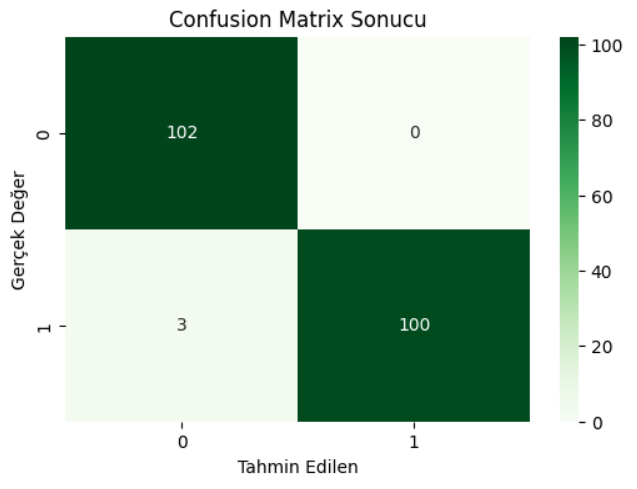

# Kalp Hastalığı Teşhis Modeli (Heart Disease Prediction)

Bu proje, makine öğrenmesi yöntemlerini kullanarak kalp hastalığı riskini tahmin etmek amacıyla geliştirilmiştir.

## Kullanılan Teknolojiler
* Python (Pandas, Seaborn, Matplotlib)
* Scikit-Learn (Random Forest Classifier)
* Jupyter Notebook

## Veri Seti
Kaggle'dan alınan Heart Disease veri seti kullanılmıştır.

## Başarı Oranı
Model, test verileri üzerinde **%98.54** başarı göstermiştir.

